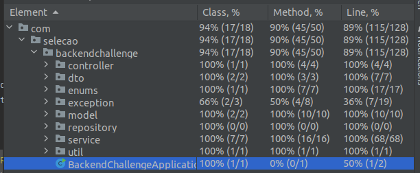

## Desafio Produtos de Seguros 

## Resumo
* [Como rodar o projeto](#como_rodar_o_projeto)
* [Sobre os testes automatizados](#testes)
* [Como rodar os testes](#como_rodar_os_testes)
* [Informações gerais](#informacoes_gerais)
* [Um pouco sobre a solução proposta](#solucao_proposta)
* [Logs](#logs)
* [Métricas](#metricas)
* [Principais Bibliotecas e Tecnologias](#principais_tecnologias)

### <a name="como_rodar_o_projeto">Como rodar o projeto</a>
1. É necessário ter o Java 21 instalado na sua máquina
2. Rodar a classe BackendChallengeApplication
3. Não há variáveis de ambiente

### <a name="testes">Sobre os testes automatizados</a>
Foram feitos testes de unidade e de integração para a aplicação buscando garantir o correto funcionamento do código e o
cumprimento das regras de negócio. Cenários de sucesso e de insucesso foram testados e 
a coberta de testes foi medida com a ferramenta de geração de cobertura de testes da
IDE IntelliJ e as classes de controller, service e regras de negócios foram
100% testadas, como pode ser observado abaixo.

### <a name="Como rodar os testes">Como rodar os testes</a>
Para rodar os testes, na IDE IntelliJ por exemplo, basta clicar com o botão
direito do mouse no diretório de testes (java) e selecionar "Run Tests in java". Já pelo terminal basta rodar o comando "mvn test" na
raiz do projeto para rodar os testes com o maven (a variável JAVA_HOME deve estar apontada para o path do JDK 21 instalado na sua máquina).

### <a name="informacoes_gerais">Informações gerais</a>
- O banco de dados utilizado foi o banco relacional em memória H2. Para rodar o projeto com outro banco de dados, basta mudar as 
configurações no arquivo application.properties. 
- A porta padrão é a 8080 mas para trocar a porta basta trocar a 
configuração no arquivo application.properties.

### <a name="solucao_proposta">Um pouco sobre a solução proposta</a>
Como foi instruído no desafio, não era necessário persistir os
impostos em base de dados, então optei por declarar os valores 
dos tipos de impostos para cada categoria de seguro como 
atributos de um enum chamado InsuranceCategoy. Dessa forma, 
fica fácil encontrar os valores dos impostos para cada tipo 
de seguro e alterar os valores ou adicionar novos tipos de impostos,
pois a regra está em apenas um lugar do código, tornando o código mais
limpo e coeso. 

A classe InsuranceServiceImpl implementa o contrato
estabelecido na interface InsuranceService e é nessa classe que 
estão as regras de negócio do domínio do seguro. 

Optei por criar uma outra interface que vai estabelecer o contrato referente 
ao cálculo do preço tarifado dos seguros. No desafio, o cálculo 
do preço tarifado tem a mesma fórmula para todas as 
categorias de seguro, mas essa lógica pode mudar no futuro (pode ser que o cálculo do
preço tarifado mude para uma determinada categoria de seguro, por exemplo) e como optei por fazer
uma implementação da calculadora de preços para cada categoria, fica fácil
de dar manutenção, caso no futuro a implementação do cálculo mude e seja diferente para
cada categoria.

Aleḿ desses pontos importantes, eu considerei que a requisição para atulizar um
seguro (put), poderia apenas atualizar o seu preço base e o seu preço tarifado, e não
atualizar o nome do seguro e nem a sua categoria. Logo, se esses campos forem informados
no corpo da requisição, serão ignorados.

### <a name="logs">Logs</a>
Foi utilizado o SLF4J (Simple Logging Facade for Java) para gerar logs para a aplicação.
Logs do level INFO são gerados dentro dos métodos para fins de monitoramento.

### <a name="metricas">Métricas</a>
Foi utilizado o Spring Boot Actuator junto com o Micrometer para gerar as métricas da 
aplicação no formato que o Prometheus consome. As dependências do
actuator e do micrometer foram importadas e algumas configurações foram feitas no
arquivo application.properties para gerar as métricas no padrão do Prometheus.
Para visualizar os endpoints habilitados do actuator basta fazer uma requisicao get 
para o endpoint http://localhost:8080/actuator.

Dentro da pasta prometeus+grafana temos um arquivo docker compose que sobe dois 
containers, um container do prometeus e um container do grafana. Uma vez que o docker 
e o docker compose estejam instalados em sua máquina, basta rodar o comando docker-compose 
up dentro do diretório prometheus+grafana e os dois containers irão subir. Aí basta
criar os dashboards dentro do grafana (ou utilizar os dashboards já prontos do grafana,
como os do spring ou do micrometer) para visualizar as métricas armazenadas pelo prometeus.

Uma vez que os containers estejam de pé, é possível acessar o prometeus na url
http://localhost:9090/ e o grafana na url http://localhost:3000/.
O usuário e a senha para o login no grafana são "admin".

### <a name="principais_tecnologias">Principais Bibliotecas e Tecnologias</a>
- Java 21
- Maven
- Spring Boot
- Junit e Mockito
- Lombok
- Banco de Dados H2